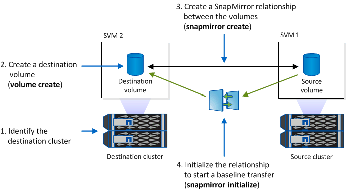

= Preparar los sistemas de almacenamiento para la replicación de SnapMirror
:allow-uri-read: 
:icons: font
:imagesdir: ../media/

[role="lead"]
Antes de poder utilizar la tecnología SnapMirror integrada de SnapManager para reflejar copias Snapshot, debe configurar una relación de protección de datos entre los volúmenes de origen y de destino; posteriormente, inicializar la relación. Tras la inicialización, SnapMirror realiza una copia Snapshot del volumen de origen y, a continuación, transfiere la copia y todos los bloques de datos que hace referencia al volumen de destino. También transfiere cualquier otra copia Snapshot menos reciente del volumen de origen al volumen de destino.

* Debe crear los volúmenes de origen y destino en clústeres con una relación entre iguales con máquinas virtuales de almacenamiento (SVM). Para obtener más información, consulte la _Guía exprés_ de relación de clústeres con clústeres de Clustered Data ONTAP.
* Debe ser un administrador de clústeres.
* Para la verificación de copias Snapshot en el volumen de destino, las SVM de origen y de destino deben tener una LIF de gestión y una LIF de datos. El LIF de gestión debe tener el mismo nombre DNS que la SVM. Defina la función de la LIF de gestión en los datos, el protocolo en none y la política de firewall en mgmt.

Puede usar la interfaz de línea de comandos (CLI) de Data ONTAP o System Manager de OnCommand para crear una relación de SnapMirror. El siguiente procedimiento asume que está utilizando la CLI. Para obtener información sobre la forma de crear relaciones de SnapMirror mediante System Manager de OnCommand, consulte la _Guía exprés de preparación para la recuperación de desastres de volúmenes de Clustered Data ONTAP_.

En la siguiente ilustración, se muestra el procedimiento para inicializar una relación de SnapMirror:

. Identifique el clúster de destino.
. En el clúster de destino, use el comando volume create con la opción -typeDP para crear un volumen de destino de SnapMirror con un tamaño igual o mayor que el volumen de origen.
+

IMPORTANT: La configuración de idioma del volumen de destino debe coincidir con la configuración de idioma del volumen de origen.

+
El siguiente comando crea un volumen de destino de 2 GB denominado dstvolB en SVM2 en el agregado node01_aggr:

+
[listing]
----
cluster2::> volume create -vserver SVM2 -volume dstvolB -aggregate node01_aggr -type DP
-size 2GB
----
. En la SVM de destino, utilice el comando snapmirror create con el parámetro -type DP para crear una relación de SnapMirror.
+
El tipo de protección de datos define la relación como una relación de SnapMirror.

+
El siguiente comando crea una relación de SnapMirror entre el volumen de origen srcvolA en SVM1 y el volumen de destino dstvolB en SVM2. De forma predeterminada, el comando asigna la política de SnapMirror predeterminada DPDefault:

+
[listing]
----
SVM2::> snapmirror create -source-path SVM1:srcvolA -destination-path SVM2:dstvolB
-type DP
----
+

NOTE: No defina una programación de mirroring para la relación de SnapMirror. SnapManager lo hace cuando se crea una programación de backup.

+
Si no desea utilizar la política predeterminada de SnapMirror, puede invocar el comando snapmirror policy create para definir una política de SnapMirror.

. Utilice el comando snapmirror initialize para inicializar la relación.
+
El proceso de inicialización realiza una transferencia básica al volumen de destino. SnapMirror realiza una copia Snapshot del volumen de origen y, a continuación, transfiere la copia y todos los bloques de datos que hace referencia al volumen de destino. También transfiere cualquier otra copia Snapshot del volumen de origen al volumen de destino.

+
El siguiente comando inicializa la relación entre el volumen de origen srcvolA en SVM1 y el volumen de destino dstvolB en SVM2:

+
[listing]
----
SVM2::> snapmirror initialize -destination-path SVM2:dstvolB
----

*Información relacionada*

https://library.netapp.com/ecm/ecm_download_file/ECMP1547469["Guía exprés de relación de clústeres entre iguales de Clustered Data ONTAP 8.3"]

https://library.netapp.com/ecm/ecm_download_file/ECMP1653500["Guía exprés de preparación para la recuperación de desastres de volúmenes de Clustered Data ONTAP 8.3"]
